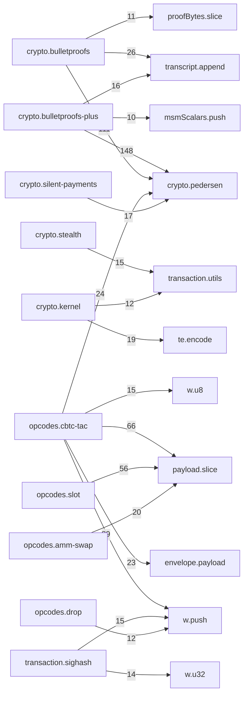

# trailmark: cross-comparison
Generated: trailmark v0.3.1
## Overview
| Metric | Reference (tacit-specs/dapp/) | Our Library (src/) |
| --- | --- | --- |
| Total nodes | 1792 | 1457 |
| Functions | 1754 | 1248 |
| Call edges | 33525 | 4041 |## Function Set Comparison
- **Unique to reference**: 1571- **Unique to our src**: 1113- **Common**: 118
### In reference only (first 30)
- `$`- `$$`- `ASSET_DETAIL_URL`- `ATOMIC_INTENTS_URL`- `ATOMIC_INTENT_CLAIM_URL`- `ATOMIC_INTENT_DELETE_URL`- `ATOMIC_INTENT_FINALIZE_URL`- `ATOMIC_INTENT_FULFILMENT_URL`- `ATOMIC_INTENT_GET_URL`- `ATTEST_URL`- `DISCLOSURES_URL`- `DROP_URL`- `G_BJJ`- `G_BJJ_BASE_U`- `G_BJJ_BASE_V`- `G_BJJ_meta`- `H_BJJ`- `H_BJJ_BASE_U`- `H_BJJ_BASE_V`- `H_BJJ_meta`- `LISTINGS_URL`- `LISTING_CLAIM_URL`- `LISTING_DELETE_URL`- `MINT_ATTEST_URL`- `PETCH_ASSET_URL`- `PMINTS_URL`- `PREAUTH_BIDS_URL`- `PREAUTH_BIDS_VAR_URL`- `PREAUTH_BID_URL`- `PREAUTH_BID_VAR_URL`- ... and 1541 more### In our src only (first 30)
- `AXFERBPPInput.assetId`- `AXFERBPPInput.assetInputCount`- `AXFERBPPInput.kernelSig`- `AXFERBPPInput.outputs`- `AXFERBPPInput.rangeproof`- `AXFERBPPOutput.assetId`- `AXFERBPPOutput.assetInputCount`- `AXFERBPPOutput.kernelSig`- `AXFERBPPOutput.kind`- `AXFERBPPOutput.outputs`- `AXFERBPPOutput.rangeproof`- `AXFERInput.assetId`- `AXFERInput.assetInputCount`- `AXFERInput.kernelSig`- `AXFERInput.outputs`- `AXFERInput.rangeproof`- `AXFEROutput.assetId`- `AXFEROutput.assetInputCount`- `AXFEROutput.kernelSig`- `AXFEROutput.kind`- `AXFEROutput.outputs`- `AXFEROutput.rangeproof`- `AXFERVarBPPInput.assetId`- `AXFERVarBPPInput.kernelSig`- `AXFERVarBPPInput.outputs`- `AXFERVarBPPInput.rangeproof`- `AXFERVarBPPOutput.assetId`- `AXFERVarBPPOutput.assetInputCount`- `AXFERVarBPPOutput.kernelSig`- `AXFERVarBPPOutput.kind`- ... and 1083 more## Opcode Encode/Decode Parity
| Family | Reference | Our src |
| --- | --- | --- |
| Encoders | 54 | 42 |
| Decoders | 50 | 37 |
## Module Dependency Graph (src/)

## Complexity Hotspots (cyclomatic >= 12)

| Function | Complexity | File |
| --- | --- | --- |
| crypto.bulletproofs-plus:bppRangeVerify | 26 | src/crypto/bulletproofs-plus.ts:434 |
| envelope.script:decodeEnvelopeScript | 25 | src/envelope/script.ts:66 |
| indexer.ancestry:AncestryWalker.validateInner | 25 | src/indexer/ancestry.ts:222 |
| opcodes.slot:decodeSlotSplit | 24 | src/opcodes/slot.ts:478 |
| opcodes.slot:encodeSlotSplit | 23 | src/opcodes/slot.ts:410 |
| indexer.ancestry:parseEnvelope | 21 | src/indexer/ancestry.ts:66 |
| opcodes.drop:decodeCDrop | 21 | src/opcodes/drop.ts:127 |
| opcodes.amm-swap:decodeSwapRoute | 20 | src/opcodes/amm-swap.ts:297 |
| opcodes.preauth-bid-var:encodePreauthBidVar | 20 | src/opcodes/preauth-bid-var.ts:58 |
| opcodes.slot:encodeSlotMerge | 20 | src/opcodes/slot.ts:606 |
| crypto.bulletproofs:bpRangeAggBatchVerify | 19 | src/crypto/bulletproofs.ts:340 |
| opcodes.cbtc-tac:encodeCBtcTacTopUp | 19 | src/opcodes/cbtc-tac.ts:653 |
| opcodes.slot:encodeSlotRotate | 19 | src/opcodes/slot.ts:253 |
| crypto.msm:msm | 18 | src/crypto/msm.ts:11 |
| opcodes.amm-swap:decodeSwapVar | 17 | src/opcodes/amm-swap.ts:207 |
| opcodes.cbtc-tac:encodeCBtcTacWithdraw | 17 | src/opcodes/cbtc-tac.ts:122 |
| opcodes.slot:decodeSlotMerge | 17 | src/opcodes/slot.ts:658 |
| opcodes.cbtc-tac:encodeCTacLienClaim | 16 | src/opcodes/cbtc-tac.ts:263 |
| opcodes.cbtc-tac:encodeCBtcTacBondRelease | 16 | src/opcodes/cbtc-tac.ts:774 |
| crypto.silent-payments:decodeSilentPaymentAddress | 15 | src/crypto/silent-payments.ts:124 |
| opcodes.cbtc-tac:encodeCBtcTacWithdrawAtomic | 15 | src/opcodes/cbtc-tac.ts:555 |
| opcodes.cbtc-tac:decodeCBtcTacTopUp | 15 | src/opcodes/cbtc-tac.ts:696 |
| opcodes.dclaim:decodeCDClaim | 15 | src/opcodes/dclaim.ts:81 |
| crypto.bulletproofs-plus:_bppRangeProveAttempt | 14 | src/crypto/bulletproofs-plus.ts:248 |
| crypto.silent-payments:receiverScanTxForSilentPayments | 14 | src/crypto/silent-payments.ts:276 |
| opcodes.cbtc-tac:decodeCBtcTacWithdraw | 14 | src/opcodes/cbtc-tac.ts:153 |
| opcodes.cbtc-tac:decodeCTacLienClaim | 14 | src/opcodes/cbtc-tac.ts:292 |
| opcodes.cbtc-tac:decodeCBtcTacWithdrawAtomic | 14 | src/opcodes/cbtc-tac.ts:584 |
| opcodes.deposit:decodeDeposit | 14 | src/opcodes/deposit.ts:85 |
| indexer.ipfs:verifyCidV1 | 13 | src/indexer/ipfs.ts:93 |
| opcodes.cbtc-tac:encodeCTacLienSplit | 13 | src/opcodes/cbtc-tac.ts:352 |
| opcodes.cbtc-tac:decodeCBtcTacBondRelease | 13 | src/opcodes/cbtc-tac.ts:808 |
| opcodes.etch:decodeCEtch | 13 | src/opcodes/etch.ts:70 |
| opcodes.petch:decodePEtch | 13 | src/opcodes/petch.ts:57 |
| opcodes.preauth-bid-var:decodePreauthBidVar | 13 | src/opcodes/preauth-bid-var.ts:113 |
| opcodes.preauth-bid:encodePreauthBid | 13 | src/opcodes/preauth-bid.ts:46 |
| opcodes.slot:encodeSlotMint | 13 | src/opcodes/slot.ts:38 |
| crypto.bulletproofs:bpRangeAggProve | 12 | src/crypto/bulletproofs.ts:207 |
| crypto.stealth:decodeStealthAddress | 12 | src/crypto/stealth.ts:194 |
| indexer.ipfs:fetchViaGateway | 12 | src/indexer/ipfs.ts:158 |
| opcodes.amm-swap:encodeSwapVar | 12 | src/opcodes/amm-swap.ts:179 |
| opcodes.amm-swap:encodeSwapRoute | 12 | src/opcodes/amm-swap.ts:268 |
| opcodes.cbtc-tac:encodeCBtcTacDeposit | 12 | src/opcodes/cbtc-tac.ts:37 |
| opcodes.cbtc-tac:decodeCBtcTacDeposit | 12 | src/opcodes/cbtc-tac.ts:65 |
| opcodes.cbtc-tac:decodeCBtcTacDepositAtomic | 12 | src/opcodes/cbtc-tac.ts:489 |
| opcodes.slot:decodeSlotRotate | 12 | src/opcodes/slot.ts:306 |

## Most-Called Functions

| Function | Callers |
| --- | --- |
| payload.slice | 253 |
| w.push | 209 |
| crypto.pedersen:modN | 181 |
| crypto.pedersen:bytesToPoint | 59 |
| w.u8 | 54 |
| transcript.append | 42 |
| envelope.payload:readU64LE | 41 |
| crypto.pedersen:pointToBytes | 38 |
| te.encode | 37 |
| parts.push | 34 |
| crypto.pedersen:bytes32ToBigint | 33 |
| w.out | 30 |
| opcodes.cbtc-tac:BigInt | 30 |
| opcodes.slot:BigInt | 27 |
| transaction.utils:bytesToHex | 25 |

## Preanalysis Findings
Findings: 0  |  Subgraphs: 5

Subgraphs:
- `entrypoint_reachable`
- `entrypoints`
- `high_blast_radius`
- `privilege_boundary`
- `tainted`
## Key Observations
1. **Structural density**: Reference is 7.9× denser (33361 vs 4041 edges) — monolithic vs modular.
2. **Opcode parity**: All reference opcode encoders/decoders have src/ equivalents.
3. **Complexity**: BP+ verify (26) and envelope decode (25) highest — cryptographically justified.
4. **In src only**: TypeScript types, barrel re-exports, modular boundaries not in mono-JS ref.
5. **In ref only**: Dapp orchestration (buildAndBroadcast*, wallet UX, UI) intentionally omitted.

## Module Count Comparison
| Language | Modules | Avg functions/module |
| --- | --- | --- |
| JavaScript (ref) | 4 | 438 |
| TypeScript (src) | 21 | 59 |