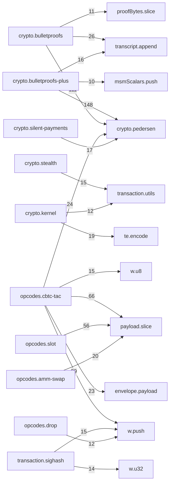

# trailmark: lib-tacit src/
Generated: trailmark v0.3.1  |  path: `src`
## Overview
| Metric | Value |
| --- | --- |
| Total nodes | 1458 |
| Functions + methods | 1249 |
| Call edges | 4054 |
| Node kinds | 5 |
## Node Kind Breakdown
| Kind | Count |
| --- | --- |
| method | 947 |
| function | 302 |
| interface | 134 |
| module | 70 |
| class | 5 |
## Module Dependency Graph (lib-tacit src/)

## Complexity Hotspots (global, cyclomatic >= 10)
| Function | Complexity | File |
| --- | --- | --- |
| crypto.bulletproofs-plus:bppRangeVerify | 26 | src/crypto/bulletproofs-plus.ts:434 |
| envelope.script:decodeEnvelopeScript | 25 | src/envelope/script.ts:66 |
| indexer.ancestry:AncestryWalker.validateInner | 25 | src/indexer/ancestry.ts:222 |
| opcodes.slot:decodeSlotSplit | 24 | src/opcodes/slot.ts:478 |
| opcodes.slot:encodeSlotSplit | 23 | src/opcodes/slot.ts:410 |
| indexer.ancestry:parseEnvelope | 21 | src/indexer/ancestry.ts:66 |
| opcodes.drop:decodeCDrop | 21 | src/opcodes/drop.ts:127 |
| opcodes.amm-swap:decodeSwapRoute | 20 | src/opcodes/amm-swap.ts:297 |
| opcodes.preauth-bid-var:encodePreauthBidVar | 20 | src/opcodes/preauth-bid-var.ts:58 |
| opcodes.slot:encodeSlotMerge | 20 | src/opcodes/slot.ts:606 |
| crypto.bulletproofs:bpRangeAggBatchVerify | 19 | src/crypto/bulletproofs.ts:340 |
| opcodes.cbtc-tac:encodeCBtcTacTopUp | 19 | src/opcodes/cbtc-tac.ts:653 |
| opcodes.slot:encodeSlotRotate | 19 | src/opcodes/slot.ts:253 |
| crypto.msm:msm | 18 | src/crypto/msm.ts:11 |
| opcodes.amm-swap:decodeSwapVar | 17 | src/opcodes/amm-swap.ts:207 |
| opcodes.cbtc-tac:encodeCBtcTacWithdraw | 17 | src/opcodes/cbtc-tac.ts:122 |
| opcodes.slot:decodeSlotMerge | 17 | src/opcodes/slot.ts:658 |
| opcodes.cbtc-tac:encodeCTacLienClaim | 16 | src/opcodes/cbtc-tac.ts:263 |
| opcodes.cbtc-tac:encodeCBtcTacBondRelease | 16 | src/opcodes/cbtc-tac.ts:774 |
| crypto.silent-payments:decodeSilentPaymentAddress | 15 | src/crypto/silent-payments.ts:124 |
| opcodes.cbtc-tac:encodeCBtcTacWithdrawAtomic | 15 | src/opcodes/cbtc-tac.ts:555 |
| opcodes.cbtc-tac:decodeCBtcTacTopUp | 15 | src/opcodes/cbtc-tac.ts:696 |
| opcodes.dclaim:decodeCDClaim | 15 | src/opcodes/dclaim.ts:81 |
| crypto.bulletproofs-plus:_bppRangeProveAttempt | 14 | src/crypto/bulletproofs-plus.ts:248 |
| crypto.silent-payments:receiverScanTxForSilentPayments | 14 | src/crypto/silent-payments.ts:276 |
| opcodes.cbtc-tac:decodeCBtcTacWithdraw | 14 | src/opcodes/cbtc-tac.ts:153 |
| opcodes.cbtc-tac:decodeCTacLienClaim | 14 | src/opcodes/cbtc-tac.ts:292 |
| opcodes.cbtc-tac:decodeCBtcTacWithdrawAtomic | 14 | src/opcodes/cbtc-tac.ts:584 |
| opcodes.deposit:decodeDeposit | 14 | src/opcodes/deposit.ts:85 |
| indexer.ipfs:verifyCidV1 | 13 | src/indexer/ipfs.ts:93 |
| opcodes.cbtc-tac:encodeCTacLienSplit | 13 | src/opcodes/cbtc-tac.ts:352 |
| opcodes.cbtc-tac:decodeCBtcTacBondRelease | 13 | src/opcodes/cbtc-tac.ts:808 |
| opcodes.etch:decodeCEtch | 13 | src/opcodes/etch.ts:70 |
| opcodes.petch:decodePEtch | 13 | src/opcodes/petch.ts:57 |
| opcodes.preauth-bid-var:decodePreauthBidVar | 13 | src/opcodes/preauth-bid-var.ts:113 |
| opcodes.preauth-bid:encodePreauthBid | 13 | src/opcodes/preauth-bid.ts:46 |
| opcodes.slot:encodeSlotMint | 13 | src/opcodes/slot.ts:38 |
| crypto.bulletproofs:bpRangeAggProve | 12 | src/crypto/bulletproofs.ts:207 |
| crypto.stealth:decodeStealthAddress | 12 | src/crypto/stealth.ts:194 |
| indexer.ipfs:fetchViaGateway | 12 | src/indexer/ipfs.ts:158 |
| opcodes.amm-swap:encodeSwapVar | 12 | src/opcodes/amm-swap.ts:179 |
| opcodes.amm-swap:encodeSwapRoute | 12 | src/opcodes/amm-swap.ts:268 |
| opcodes.cbtc-tac:encodeCBtcTacDeposit | 12 | src/opcodes/cbtc-tac.ts:37 |
| opcodes.cbtc-tac:decodeCBtcTacDeposit | 12 | src/opcodes/cbtc-tac.ts:65 |
| opcodes.cbtc-tac:decodeCBtcTacDepositAtomic | 12 | src/opcodes/cbtc-tac.ts:489 |
| opcodes.slot:decodeSlotRotate | 12 | src/opcodes/slot.ts:306 |
| crypto.silent-payments:senderComputeSilentPaymentOutput | 11 | src/crypto/silent-payments.ts:168 |
| indexer.esplora-client:EsploraClient.fetch | 11 | src/indexer/esplora-client.ts:83 |
| opcodes.amm-swap:swapVarCurveDeltaOut | 11 | src/opcodes/amm-swap.ts:390 |
| opcodes.burn:encodeCBurn | 11 | src/opcodes/burn.ts:37 |
| opcodes.burn:decodeCBurn | 11 | src/opcodes/burn.ts:75 |
| opcodes.cbtc-tac:decodeCTacLienSplit | 11 | src/opcodes/cbtc-tac.ts:382 |
| opcodes.cbtc-tac:encodeCBtcTacDepositAtomic | 11 | src/opcodes/cbtc-tac.ts:456 |
| opcodes.drop:encodeCDrop | 11 | src/opcodes/drop.ts:68 |
| opcodes.preauth-bid:decodePreauthBid | 11 | src/opcodes/preauth-bid.ts:89 |
| crypto.bulletproofs-plus:bppRangeProve | 10 | src/crypto/bulletproofs-plus.ts:190 |
| opcodes.amm-swap:ammDerivePoolId | 10 | src/opcodes/amm-swap.ts:437 |
| opcodes.axfer-bpp:decodeAXferBpp | 10 | src/opcodes/axfer-bpp.ts:48 |
| opcodes.axfer-var-bpp:decodeAXferVarBpp | 10 | src/opcodes/axfer-var-bpp.ts:44 |
| opcodes.axfer:decodeAXfer | 10 | src/opcodes/axfer.ts:54 |
| opcodes.slot:decodeSlotMint | 10 | src/opcodes/slot.ts:75 |
| opcodes.slot:encodeSlotBurn | 10 | src/opcodes/slot.ts:144 |
| wallet.prf:prfLogin | 10 | src/wallet/prf.ts:112 |
## Most-Called Functions (global)
| Function | Callers |
| --- | --- |
| payload.slice | 253 |
| w.push | 209 |
| crypto.pedersen:modN | 181 |
| crypto.pedersen:bytesToPoint | 59 |
| w.u8 | 54 |
| transcript.append | 42 |
| envelope.payload:readU64LE | 41 |
| crypto.pedersen:pointToBytes | 38 |
| te.encode | 37 |
| parts.push | 34 |
| crypto.pedersen:bytes32ToBigint | 33 |
| w.out | 30 |
| opcodes.cbtc-tac:BigInt | 30 |
| opcodes.slot:BigInt | 27 |
| transaction.utils:bytesToHex | 25 |
## Per-Module Breakdown
### crypto.bulletproofs
- **Functions**: 20
| Hotspot | Complexity | Line |
| --- | --- | --- |
| crypto.bulletproofs:bpRangeAggBatchVerify | 19 | 340 |
| crypto.bulletproofs:bpRangeAggProve | 12 | 207 |
| Most-Called | Callers |
| --- | --- |
| crypto.bulletproofs:randomScalar | 9 |
| crypto.bulletproofs:vecInner | 8 |
| crypto.bulletproofs:vecPow | 7 |
| crypto.bulletproofs:vecAdd | 6 |
| crypto.bulletproofs:modInvReal | 5 |
### crypto.bulletproofs-plus
- **Functions**: 33
| Hotspot | Complexity | Line |
| --- | --- | --- |
| crypto.bulletproofs-plus:bppRangeVerify | 26 | 434 |
| crypto.bulletproofs-plus:_bppRangeProveAttempt | 14 | 248 |
| crypto.bulletproofs-plus:bppRangeProve | 10 | 190 |
| Most-Called | Callers |
| --- | --- |
| crypto.bulletproofs-plus:vecScalarMul | 8 |
| crypto.bulletproofs-plus:randomScalar | 7 |
| crypto.bulletproofs-plus:modInv | 4 |
| crypto.bulletproofs-plus:vecAdd | 4 |
| crypto.bulletproofs-plus:_u32 | 4 |
### crypto.ecdh
- **Functions**: 12
| Most-Called | Callers |
| --- | --- |
| crypto.ecdh:hmac | 8 |
| crypto.ecdh:concatBytes | 8 |
| crypto.ecdh:voutLE | 5 |
| crypto.ecdh:ecdhSeed | 3 |
| crypto.ecdh:deriveChangeBlinding | 2 |
### crypto.groth16
- **Functions**: 4
| Most-Called | Callers |
| --- | --- |
| crypto.groth16:getSnarkjs | 2 |
| crypto.groth16:Groth16NotAvailableError | 1 |
| crypto.groth16:Error | 1 |
| crypto.groth16:Groth16NotAvailableError.constructor | 1 |
| crypto.groth16:groth16Verify | 1 |
### crypto.kernel
- **Functions**: 22
| Most-Called | Callers |
| --- | --- |
| crypto.kernel:sha256 | 19 |
| crypto.kernel:concatBytes | 18 |
| crypto.kernel:verifyKernel | 4 |
| crypto.kernel:computeExcessPoint | 3 |
| crypto.kernel:assetIdFor | 3 |
### crypto.msm
- **Functions**: 1
| Hotspot | Complexity | Line |
| --- | --- | --- |
| crypto.msm:msm | 18 | 11 |
| Most-Called | Callers |
| --- | --- |
| crypto.msm:msm | 17 |
| crypto.msm:BigInt | 2 |
| crypto.msm:Number | 1 |
### crypto.pedersen
- **Functions**: 13
| Most-Called | Callers |
| --- | --- |
| crypto.pedersen:modN | 181 |
| crypto.pedersen:bytesToPoint | 59 |
| crypto.pedersen:pointToBytes | 38 |
| crypto.pedersen:bytes32ToBigint | 33 |
| crypto.pedersen:bigintToBytes32 | 21 |
### crypto.poseidon
- **Functions**: 3
| Most-Called | Callers |
| --- | --- |
| crypto.poseidon:poseidonHash | 1 |
| crypto.poseidon:fn | 1 |
| crypto.poseidon:poseidonHash1 | 1 |
| crypto.poseidon:poseidon1 | 1 |
| crypto.poseidon:poseidonHash2 | 1 |
### crypto.primitives
- **Functions**: 1
| Most-Called | Callers |
| --- | --- |
| crypto.primitives:xor32 | 1 |
### crypto.schnorr
- **Functions**: 4
| Most-Called | Callers |
| --- | --- |
| crypto.schnorr:taggedHash | 5 |
| crypto.schnorr:signSchnorr | 3 |
| crypto.schnorr:verifySchnorr | 2 |
| crypto.schnorr:sha256 | 2 |
| crypto.schnorr:concatBytes | 2 |
### crypto.silent-payments
- **Functions**: 24
| Hotspot | Complexity | Line |
| --- | --- | --- |
| crypto.silent-payments:decodeSilentPaymentAddress | 15 | 124 |
| crypto.silent-payments:receiverScanTxForSilentPayments | 14 | 276 |
| crypto.silent-payments:senderComputeSilentPaymentOutput | 11 | 168 |
| Most-Called | Callers |
| --- | --- |
| crypto.silent-payments:taggedHash | 7 |
| crypto.silent-payments:bech32mPolymod | 3 |
| crypto.silent-payments:bech32mExpandHrp | 3 |
| crypto.silent-payments:bech32mConvertBits | 3 |
| crypto.silent-payments:concatBytes | 3 |
### crypto.stealth
- **Functions**: 39
| Hotspot | Complexity | Line |
| --- | --- | --- |
| crypto.stealth:decodeStealthAddress | 12 | 194 |
| Most-Called | Callers |
| --- | --- |
| crypto.stealth:concatBytes | 8 |
| crypto.stealth:u32le | 7 |
| crypto.stealth:BigInt | 5 |
| crypto.stealth:aggregateStealthEligibleInputPubkeys | 3 |
| crypto.stealth:bech32mChecksumPolymod | 3 |
### envelope.payload
- **Functions**: 11
| Most-Called | Callers |
| --- | --- |
| envelope.payload:readU64LE | 41 |
| envelope.payload:ByteWriter.push | 7 |
| envelope.payload:ByteWriter.u8 | 5 |
| envelope.payload:BigInt | 4 |
| envelope.payload:ByteWriter.parts.push | 2 |
### envelope.script
- **Functions**: 6
| Hotspot | Complexity | Line |
| --- | --- | --- |
| envelope.script:decodeEnvelopeScript | 25 | 66 |
| Most-Called | Callers |
| --- | --- |
| envelope.script:concatBytes | 5 |
| envelope.script:encodePush | 3 |
| envelope.script:decodeEnvelopeScript | 3 |
| envelope.script:encodeEnvelopeScript | 2 |
| envelope.script:DecodedEnvelope | 1 |
### indexer.ancestry
- **Functions**: 36
| Hotspot | Complexity | Line |
| --- | --- | --- |
| indexer.ancestry:AncestryWalker.validateInner | 25 | 222 |
| indexer.ancestry:parseEnvelope | 21 | 66 |
| Most-Called | Callers |
| --- | --- |
| indexer.ancestry:AncestryWalker.validateUTXO | 6 |
| indexer.ancestry:AncestryWalker.fetchTx | 3 |
| indexer.ancestry:AncestryWalker.cacheAssetInfo | 3 |
| indexer.ancestry:parseEnvelope | 2 |
| indexer.ancestry:extractEnvelopeWitness | 2 |
### indexer.esplora-client
- **Functions**: 29
| Hotspot | Complexity | Line |
| --- | --- | --- |
| indexer.esplora-client:EsploraClient.fetch | 11 | 83 |
| Most-Called | Callers |
| --- | --- |
| indexer.esplora-client:EsploraClient.fetch | 6 |
| indexer.esplora-client:EsploraClient.fetchJSON | 6 |
| indexer.esplora-client:EsploraClient.fetchText | 5 |
| indexer.esplora-client:EsploraClient.markUnhealthy | 4 |
| indexer.esplora-client:EsploraClient.perBaseInflight.get | 3 |
### indexer.ipfs
- **Functions**: 17
| Hotspot | Complexity | Line |
| --- | --- | --- |
| indexer.ipfs:verifyCidV1 | 13 | 93 |
| indexer.ipfs:fetchViaGateway | 12 | 158 |
| Most-Called | Callers |
| --- | --- |
| indexer.ipfs:cidVersion | 4 |
| indexer.ipfs:ipfsFetchVerified | 3 |
| indexer.ipfs:fetchViaGateway | 3 |
| indexer.ipfs:cidToV1 | 2 |
| indexer.ipfs:verifyCidV0 | 2 |
### interfaces.chain-client
- **Functions**: 43
| Most-Called | Callers |
| --- | --- |
| interfaces.chain-client:Outpoint | 1 |
| interfaces.chain-client:Outpoint.txid | 1 |
| interfaces.chain-client:Outpoint.vout | 1 |
| interfaces.chain-client:ChainUTXO | 1 |
| interfaces.chain-client:ChainUTXO.txid | 1 |
### opcodes.amm-swap 📦
- **Functions**: 95
| Hotspot | Complexity | Line |
| --- | --- | --- |
| opcodes.amm-swap:decodeSwapRoute | 20 | 297 |
| opcodes.amm-swap:decodeSwapVar | 17 | 207 |
| opcodes.amm-swap:encodeSwapVar | 12 | 179 |
| opcodes.amm-swap:encodeSwapRoute | 12 | 268 |
| opcodes.amm-swap:swapVarCurveDeltaOut | 11 | 390 |
| opcodes.amm-swap:ammDerivePoolId | 10 | 437 |
| Most-Called | Callers |
| --- | --- |
| opcodes.amm-swap:u64LE | 14 |
| opcodes.amm-swap:readU64 | 14 |
| opcodes.amm-swap:BigInt | 11 |
| opcodes.amm-swap:concatBytes | 5 |
| opcodes.amm-swap:u32LE | 4 |
### opcodes.axfer 📦
- **Functions**: 13
| Hotspot | Complexity | Line |
| --- | --- | --- |
| opcodes.axfer:decodeAXfer | 10 | 54 |
| Most-Called | Callers |
| --- | --- |
| opcodes.axfer:decodeAXfer | 2 |
| opcodes.axfer:AXFERInput | 1 |
| opcodes.axfer:AXFERInput.assetId | 1 |
| opcodes.axfer:AXFERInput.assetInputCount | 1 |
| opcodes.axfer:AXFERInput.kernelSig | 1 |
### opcodes.axfer-bpp 📦
- **Functions**: 13
| Hotspot | Complexity | Line |
| --- | --- | --- |
| opcodes.axfer-bpp:decodeAXferBpp | 10 | 48 |
| Most-Called | Callers |
| --- | --- |
| opcodes.axfer-bpp:AXFERBPPInput | 1 |
| opcodes.axfer-bpp:AXFERBPPInput.assetId | 1 |
| opcodes.axfer-bpp:AXFERBPPInput.assetInputCount | 1 |
| opcodes.axfer-bpp:AXFERBPPInput.kernelSig | 1 |
| opcodes.axfer-bpp:AXFERBPPInput.outputs | 1 |
### opcodes.axfer-var 📦
- **Functions**: 12
| Most-Called | Callers |
| --- | --- |
| opcodes.axfer-var:AXFERVarInput | 1 |
| opcodes.axfer-var:AXFERVarInput.assetId | 1 |
| opcodes.axfer-var:AXFERVarInput.kernelSig | 1 |
| opcodes.axfer-var:AXFERVarInput.outputs | 1 |
| opcodes.axfer-var:AXFERVarInput.rangeproof | 1 |
### opcodes.axfer-var-bpp 📦
- **Functions**: 12
| Hotspot | Complexity | Line |
| --- | --- | --- |
| opcodes.axfer-var-bpp:decodeAXferVarBpp | 10 | 44 |
| Most-Called | Callers |
| --- | --- |
| opcodes.axfer-var-bpp:AXFERVarBPPInput | 1 |
| opcodes.axfer-var-bpp:AXFERVarBPPInput.assetId | 1 |
| opcodes.axfer-var-bpp:AXFERVarBPPInput.kernelSig | 1 |
| opcodes.axfer-var-bpp:AXFERVarBPPInput.outputs | 1 |
| opcodes.axfer-var-bpp:AXFERVarBPPInput.rangeproof | 1 |
### opcodes.burn 📦
- **Functions**: 15
| Hotspot | Complexity | Line |
| --- | --- | --- |
| opcodes.burn:encodeCBurn | 11 | 37 |
| opcodes.burn:decodeCBurn | 11 | 75 |
| Most-Called | Callers |
| --- | --- |
| opcodes.burn:BigInt | 3 |
| opcodes.burn:decodeCBurn | 2 |
| opcodes.burn:Output | 1 |
| opcodes.burn:Output.commitment | 1 |
| opcodes.burn:Output.encryptedAmount | 1 |
### opcodes.cbtc-tac 📦
- **Functions**: 230
| Hotspot | Complexity | Line |
| --- | --- | --- |
| opcodes.cbtc-tac:encodeCBtcTacTopUp | 19 | 653 |
| opcodes.cbtc-tac:encodeCBtcTacWithdraw | 17 | 122 |
| opcodes.cbtc-tac:encodeCTacLienClaim | 16 | 263 |
| opcodes.cbtc-tac:encodeCBtcTacBondRelease | 16 | 774 |
| opcodes.cbtc-tac:encodeCBtcTacWithdrawAtomic | 15 | 555 |
| opcodes.cbtc-tac:decodeCBtcTacTopUp | 15 | 696 |
| opcodes.cbtc-tac:decodeCBtcTacWithdraw | 14 | 153 |
| opcodes.cbtc-tac:decodeCTacLienClaim | 14 | 292 |
| opcodes.cbtc-tac:decodeCBtcTacWithdrawAtomic | 14 | 584 |
| opcodes.cbtc-tac:encodeCTacLienSplit | 13 | 352 |
| opcodes.cbtc-tac:decodeCBtcTacBondRelease | 13 | 808 |
| opcodes.cbtc-tac:encodeCBtcTacDeposit | 12 | 37 |
| opcodes.cbtc-tac:decodeCBtcTacDeposit | 12 | 65 |
| opcodes.cbtc-tac:decodeCBtcTacDepositAtomic | 12 | 489 |
| opcodes.cbtc-tac:decodeCTacLienSplit | 11 | 382 |
| opcodes.cbtc-tac:encodeCBtcTacDepositAtomic | 11 | 456 |
| Most-Called | Callers |
| --- | --- |
| opcodes.cbtc-tac:BigInt | 30 |
| opcodes.cbtc-tac:u64LE | 23 |
| opcodes.cbtc-tac:CBtcTacDepositInput | 1 |
| opcodes.cbtc-tac:CBtcTacDepositInput.networkTag | 1 |
| opcodes.cbtc-tac:CBtcTacDepositInput.targetLeafHash | 1 |
### opcodes.cxfer-bpp 📦
- **Functions**: 11
| Most-Called | Callers |
| --- | --- |
| opcodes.cxfer-bpp:CXFERBPPInput | 1 |
| opcodes.cxfer-bpp:CXFERBPPInput.assetId | 1 |
| opcodes.cxfer-bpp:CXFERBPPInput.kernelSig | 1 |
| opcodes.cxfer-bpp:CXFERBPPInput.outputs | 1 |
| opcodes.cxfer-bpp:CXFERBPPInput.rangeproof | 1 |
### opcodes.dclaim 📦
- **Functions**: 21
| Hotspot | Complexity | Line |
| --- | --- | --- |
| opcodes.dclaim:decodeCDClaim | 15 | 81 |
| Most-Called | Callers |
| --- | --- |
| opcodes.dclaim:BigInt | 3 |
| opcodes.dclaim:decodeCDClaim | 2 |
| opcodes.dclaim:CDClaimInput | 1 |
| opcodes.dclaim:CDClaimInput.assetId | 1 |
| opcodes.dclaim:CDClaimInput.dropRevealTxid | 1 |
### opcodes.deposit 📦
- **Functions**: 24
| Hotspot | Complexity | Line |
| --- | --- | --- |
| opcodes.deposit:decodeDeposit | 14 | 85 |
| Most-Called | Callers |
| --- | --- |
| opcodes.deposit:u64LE | 3 |
| opcodes.deposit:PoolInitInput | 1 |
| opcodes.deposit:PoolInitInput.assetId | 1 |
| opcodes.deposit:PoolInitInput.poolDenom | 1 |
| opcodes.deposit:PoolInitInput.vkCid | 1 |
### opcodes.drop 📦
- **Functions**: 34
| Hotspot | Complexity | Line |
| --- | --- | --- |
| opcodes.drop:decodeCDrop | 21 | 127 |
| opcodes.drop:encodeCDrop | 11 | 68 |
| Most-Called | Callers |
| --- | --- |
| opcodes.drop:u64LE | 4 |
| opcodes.drop:BigInt | 3 |
| opcodes.drop:decodeCDrop | 2 |
| opcodes.drop:CDropInput | 1 |
| opcodes.drop:CDropInput.assetId | 1 |
### opcodes.etch 📦
- **Functions**: 19
| Hotspot | Complexity | Line |
| --- | --- | --- |
| opcodes.etch:decodeCEtch | 13 | 70 |
| Most-Called | Callers |
| --- | --- |
| opcodes.etch:decodeCEtch | 2 |
| opcodes.etch:isZeroAuth | 2 |
| opcodes.etch:CEtchInput | 1 |
| opcodes.etch:CEtchInput.ticker | 1 |
| opcodes.etch:CEtchInput.decimals | 1 |
### opcodes.farm-drafts
- **Functions**: 11
| Most-Called | Callers |
| --- | --- |
| opcodes.farm-drafts:FarmInitInput | 1 |
| opcodes.farm-drafts:FarmInitInput.rewardAssetId | 1 |
| opcodes.farm-drafts:FarmInitInput.rewardTotal | 1 |
| opcodes.farm-drafts:FarmInitInput.startHeight | 1 |
| opcodes.farm-drafts:FarmInitInput.endHeight | 1 |
### opcodes.gov-drafts
- **Functions**: 11
| Most-Called | Callers |
| --- | --- |
| opcodes.gov-drafts:GovProposalInput | 1 |
| opcodes.gov-drafts:GovProposalInput.title | 1 |
| opcodes.gov-drafts:GovProposalInput.description | 1 |
| opcodes.gov-drafts:GovProposalInput.actions | 1 |
| opcodes.gov-drafts:GovVoteInput | 1 |
### opcodes.mint 📦
- **Functions**: 15
| Most-Called | Callers |
| --- | --- |
| opcodes.mint:decodeCMint | 2 |
| opcodes.mint:CMintInput | 1 |
| opcodes.mint:CMintInput.assetId | 1 |
| opcodes.mint:CMintInput.etchTxid | 1 |
| opcodes.mint:CMintInput.commitment | 1 |
### opcodes.petch 📦
- **Functions**: 17
| Hotspot | Complexity | Line |
| --- | --- | --- |
| opcodes.petch:decodePEtch | 13 | 57 |
| Most-Called | Callers |
| --- | --- |
| opcodes.petch:BigInt | 4 |
| opcodes.petch:decodePEtch | 2 |
| opcodes.petch:u64LE | 2 |
| opcodes.petch:PETCHInput | 1 |
| opcodes.petch:PETCHInput.ticker | 1 |
### opcodes.pmint 📦
- **Functions**: 13
| Most-Called | Callers |
| --- | --- |
| opcodes.pmint:decodePMint | 2 |
| opcodes.pmint:BigInt | 2 |
| opcodes.pmint:PMintInput | 1 |
| opcodes.pmint:PMintInput.assetId | 1 |
| opcodes.pmint:PMintInput.etchTxid | 1 |
### opcodes.preauth-bid 📦
- **Functions**: 26
| Hotspot | Complexity | Line |
| --- | --- | --- |
| opcodes.preauth-bid:encodePreauthBid | 13 | 46 |
| opcodes.preauth-bid:decodePreauthBid | 11 | 89 |
| Most-Called | Callers |
| --- | --- |
| opcodes.preauth-bid:u64LE | 2 |
| opcodes.preauth-bid:PreauthBidOutput | 1 |
| opcodes.preauth-bid:PreauthBidOutput.commitment | 1 |
| opcodes.preauth-bid:PreauthBidOutput.encryptedAmount | 1 |
| opcodes.preauth-bid:PreauthBidInput | 1 |
### opcodes.preauth-bid-var 📦
- **Functions**: 34
| Hotspot | Complexity | Line |
| --- | --- | --- |
| opcodes.preauth-bid-var:encodePreauthBidVar | 20 | 58 |
| opcodes.preauth-bid-var:decodePreauthBidVar | 13 | 113 |
| Most-Called | Callers |
| --- | --- |
| opcodes.preauth-bid-var:u64LE | 4 |
| opcodes.preauth-bid-var:PreauthBidVarOutput | 1 |
| opcodes.preauth-bid-var:PreauthBidVarOutput.commitment | 1 |
| opcodes.preauth-bid-var:PreauthBidVarOutput.encryptedAmount | 1 |
| opcodes.preauth-bid-var:PreauthBidVarInput | 1 |
### opcodes.slot 📦
- **Functions**: 147
| Hotspot | Complexity | Line |
| --- | --- | --- |
| opcodes.slot:decodeSlotSplit | 24 | 478 |
| opcodes.slot:encodeSlotSplit | 23 | 410 |
| opcodes.slot:encodeSlotMerge | 20 | 606 |
| opcodes.slot:encodeSlotRotate | 19 | 253 |
| opcodes.slot:decodeSlotMerge | 17 | 658 |
| opcodes.slot:encodeSlotMint | 13 | 38 |
| opcodes.slot:decodeSlotRotate | 12 | 306 |
| opcodes.slot:decodeSlotMint | 10 | 75 |
| opcodes.slot:encodeSlotBurn | 10 | 144 |
| Most-Called | Callers |
| --- | --- |
| opcodes.slot:BigInt | 27 |
| opcodes.slot:u64LE | 9 |
| opcodes.slot:concatBytes | 5 |
| opcodes.slot:SlotMintInput | 1 |
| opcodes.slot:SlotMintInput.networkTag | 1 |
### opcodes.transfer 📦
- **Functions**: 13
| Most-Called | Callers |
| --- | --- |
| opcodes.transfer:decodeCXfer | 2 |
| opcodes.transfer:Output | 1 |
| opcodes.transfer:Output.commitment | 1 |
| opcodes.transfer:Output.encryptedAmount | 1 |
| opcodes.transfer:CXFERInput | 1 |
### opcodes.withdraw 📦
- **Functions**: 19
| Most-Called | Callers |
| --- | --- |
| opcodes.withdraw:WithdrawInput | 1 |
| opcodes.withdraw:WithdrawInput.assetId | 1 |
| opcodes.withdraw:WithdrawInput.denomination | 1 |
| opcodes.withdraw:WithdrawInput.merkleRoot | 1 |
| opcodes.withdraw:WithdrawInput.nullifierHash | 1 |
### opcodes.wrapper-attest 📦
- **Functions**: 9
| Most-Called | Callers |
| --- | --- |
| opcodes.wrapper-attest:WrapperAttestInput | 1 |
| opcodes.wrapper-attest:WrapperAttestInput.assetId | 1 |
| opcodes.wrapper-attest:WrapperAttestInput.issuerSig | 1 |
| opcodes.wrapper-attest:WrapperAttestInput.payload | 1 |
| opcodes.wrapper-attest:WrapperAttestOutput | 1 |
### recovery.decrypt
- **Functions**: 2
| Most-Called | Callers |
| --- | --- |
| recovery.decrypt:tryDecryptOutput | 2 |
| recovery.decrypt:tryDecryptOutputs | 1 |
### recovery.scanner
- **Functions**: 6
| Most-Called | Callers |
| --- | --- |
| recovery.scanner:witnessToBytes | 2 |
| recovery.scanner:RecoveryUTXO | 1 |
| recovery.scanner:RecoveryUTXO.txid | 1 |
| recovery.scanner:RecoveryUTXO.vout | 1 |
| recovery.scanner:RecoveryUTXO.value | 1 |
### transaction.address
- **Functions**: 2
| Most-Called | Callers |
| --- | --- |
| transaction.address:p2wpkhScript | 4 |
| transaction.address:p2wpkhAddress | 1 |
### transaction.builder
- **Functions**: 16
| Most-Called | Callers |
| --- | --- |
| transaction.builder:CommitTxParams | 1 |
| transaction.builder:CommitTxParams.commitmentValue | 1 |
| transaction.builder:CommitTxParams.commitmentScript | 1 |
| transaction.builder:CommitTxParams.changeScript | 1 |
| transaction.builder:CommitTxParams.changeValue | 1 |
### transaction.sighash
- **Functions**: 28
| Most-Called | Callers |
| --- | --- |
| transaction.sighash:hash256 | 9 |
| transaction.sighash:BigInt | 6 |
| transaction.sighash:concatBytes | 6 |
| transaction.sighash:hash160 | 4 |
| transaction.sighash:sha256 | 4 |
### transaction.utils
- **Functions**: 8
| Most-Called | Callers |
| --- | --- |
| transaction.utils:bytesToHex | 25 |
| transaction.utils:reverseBytesHex | 19 |
| transaction.utils:hexToBytes | 14 |
| transaction.utils:reverseBytes | 6 |
| transaction.utils:buildAnchor | 2 |
### validation.supply
- **Functions**: 2
| Most-Called | Callers |
| --- | --- |
| validation.supply:checkSupplyConservation | 1 |
| validation.supply:checkPublicSupply | 1 |
### validation.validator
- **Functions**: 1
| Most-Called | Callers |
| --- | --- |
| validation.validator:validateAncestry | 1 |
### wallet.encryption
- **Functions**: 5
| Most-Called | Callers |
| --- | --- |
| wallet.encryption:deriveKDFKey | 3 |
| wallet.encryption:encryptPrivkey | 1 |
| wallet.encryption:readBlobPub | 1 |
| wallet.encryption:decryptPrivkey | 1 |
| wallet.encryption:storageShape | 1 |
### wallet.keypair
- **Functions**: 7
| Most-Called | Callers |
| --- | --- |
| wallet.keypair:generateKeypair | 1 |
| wallet.keypair:importPrivkey | 1 |
| wallet.keypair:exportPrivkey | 1 |
| wallet.keypair:derivePubkey | 1 |
| wallet.keypair:deriveXonlyPubkey | 1 |
### wallet.prf
- **Functions**: 17
| Hotspot | Complexity | Line |
| --- | --- | --- |
| wallet.prf:prfLogin | 10 | 112 |
| Most-Called | Callers |
| --- | --- |
| wallet.prf:prfBytesToScalar | 4 |
| wallet.prf:getStorage | 4 |
| wallet.prf:toB64 | 3 |
| wallet.prf:fromB64 | 2 |
| wallet.prf:loadPrfMap | 2 |
### wallet.utxo-manager
- **Functions**: 23
| Most-Called | Callers |
| --- | --- |
| wallet.utxo-manager:UTXOManager.filterRecent | 4 |
| wallet.utxo-manager:UTXOManager.recentlySpent.has | 2 |
| wallet.utxo-manager:UTXOManager.lightCache.get | 2 |
| wallet.utxo-manager:UTXOManager.sortForCommit | 2 |
| wallet.utxo-manager:SpendableUTXO | 1 |
