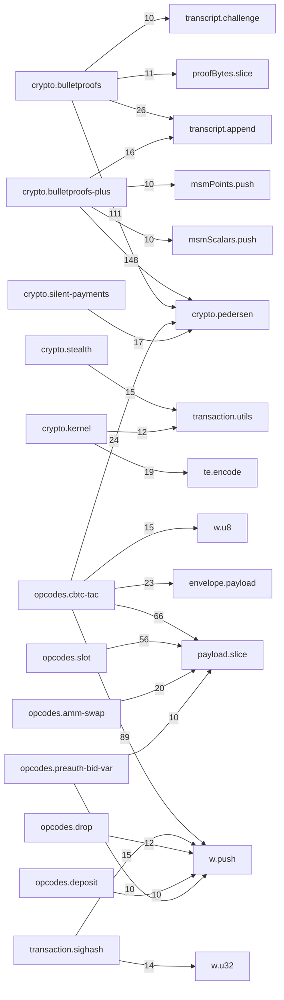

# trailmark: lib-tacit src/

Generated: trailmark v0.3.1  |  path: `src`

## Overview

| Metric | Value |
| --- | --- |
| Total nodes | 1457 |
| Functions + methods | 1248 |
| Call edges | 4041 |
| Node kinds | 5 |

## Node Kind Breakdown

| Kind | Count |
| --- | --- |
| method | 947 |
| function | 301 |
| interface | 134 |
| module | 70 |
| class | 5 |

## Module Dependency Graph

## Complexity Hotspots (cyclomatic >= 10)

| Function | Complexity | File |
| --- | --- | --- |
| crypto.bulletproofs-plus:bppRangeVerify | 26 | src/crypto/bulletproofs-plus.ts:434 |
| envelope.script:decodeEnvelopeScript | 25 | src/envelope/script.ts:66 |
| indexer.ancestry:AncestryWalker.validateInner | 25 | src/indexer/ancestry.ts:222 |
| opcodes.slot:decodeSlotSplit | 24 | src/opcodes/slot.ts:478 |
| opcodes.slot:encodeSlotSplit | 23 | src/opcodes/slot.ts:410 |
| indexer.ancestry:parseEnvelope | 21 | src/indexer/ancestry.ts:66 |
| opcodes.drop:decodeCDrop | 21 | src/opcodes/drop.ts:127 |
| opcodes.amm-swap:decodeSwapRoute | 20 | src/opcodes/amm-swap.ts:297 |
| opcodes.preauth-bid-var:encodePreauthBidVar | 20 | src/opcodes/preauth-bid-var.ts:58 |
| opcodes.slot:encodeSlotMerge | 20 | src/opcodes/slot.ts:606 |
| crypto.bulletproofs:bpRangeAggBatchVerify | 19 | src/crypto/bulletproofs.ts:340 |
| opcodes.cbtc-tac:encodeCBtcTacTopUp | 19 | src/opcodes/cbtc-tac.ts:653 |
| opcodes.slot:encodeSlotRotate | 19 | src/opcodes/slot.ts:253 |
| crypto.msm:msm | 18 | src/crypto/msm.ts:11 |
| opcodes.amm-swap:decodeSwapVar | 17 | src/opcodes/amm-swap.ts:207 |
| opcodes.cbtc-tac:encodeCBtcTacWithdraw | 17 | src/opcodes/cbtc-tac.ts:122 |
| opcodes.slot:decodeSlotMerge | 17 | src/opcodes/slot.ts:658 |
| opcodes.cbtc-tac:encodeCTacLienClaim | 16 | src/opcodes/cbtc-tac.ts:263 |
| opcodes.cbtc-tac:encodeCBtcTacBondRelease | 16 | src/opcodes/cbtc-tac.ts:774 |
| crypto.silent-payments:decodeSilentPaymentAddress | 15 | src/crypto/silent-payments.ts:124 |
| opcodes.cbtc-tac:encodeCBtcTacWithdrawAtomic | 15 | src/opcodes/cbtc-tac.ts:555 |
| opcodes.cbtc-tac:decodeCBtcTacTopUp | 15 | src/opcodes/cbtc-tac.ts:696 |
| opcodes.dclaim:decodeCDClaim | 15 | src/opcodes/dclaim.ts:81 |
| crypto.bulletproofs-plus:_bppRangeProveAttempt | 14 | src/crypto/bulletproofs-plus.ts:248 |
| crypto.silent-payments:receiverScanTxForSilentPayments | 14 | src/crypto/silent-payments.ts:276 |
| opcodes.cbtc-tac:decodeCBtcTacWithdraw | 14 | src/opcodes/cbtc-tac.ts:153 |
| opcodes.cbtc-tac:decodeCTacLienClaim | 14 | src/opcodes/cbtc-tac.ts:292 |
| opcodes.cbtc-tac:decodeCBtcTacWithdrawAtomic | 14 | src/opcodes/cbtc-tac.ts:584 |
| opcodes.deposit:decodeDeposit | 14 | src/opcodes/deposit.ts:85 |
| indexer.ipfs:verifyCidV1 | 13 | src/indexer/ipfs.ts:93 |
| opcodes.cbtc-tac:encodeCTacLienSplit | 13 | src/opcodes/cbtc-tac.ts:352 |
| opcodes.cbtc-tac:decodeCBtcTacBondRelease | 13 | src/opcodes/cbtc-tac.ts:808 |
| opcodes.etch:decodeCEtch | 13 | src/opcodes/etch.ts:70 |
| opcodes.petch:decodePEtch | 13 | src/opcodes/petch.ts:57 |
| opcodes.preauth-bid-var:decodePreauthBidVar | 13 | src/opcodes/preauth-bid-var.ts:113 |
| opcodes.preauth-bid:encodePreauthBid | 13 | src/opcodes/preauth-bid.ts:46 |
| opcodes.slot:encodeSlotMint | 13 | src/opcodes/slot.ts:38 |
| crypto.bulletproofs:bpRangeAggProve | 12 | src/crypto/bulletproofs.ts:207 |
| crypto.stealth:decodeStealthAddress | 12 | src/crypto/stealth.ts:194 |
| indexer.ipfs:fetchViaGateway | 12 | src/indexer/ipfs.ts:158 |
| opcodes.amm-swap:encodeSwapVar | 12 | src/opcodes/amm-swap.ts:179 |
| opcodes.amm-swap:encodeSwapRoute | 12 | src/opcodes/amm-swap.ts:268 |
| opcodes.cbtc-tac:encodeCBtcTacDeposit | 12 | src/opcodes/cbtc-tac.ts:37 |
| opcodes.cbtc-tac:decodeCBtcTacDeposit | 12 | src/opcodes/cbtc-tac.ts:65 |
| opcodes.cbtc-tac:decodeCBtcTacDepositAtomic | 12 | src/opcodes/cbtc-tac.ts:489 |
| opcodes.slot:decodeSlotRotate | 12 | src/opcodes/slot.ts:306 |
| crypto.silent-payments:senderComputeSilentPaymentOutput | 11 | src/crypto/silent-payments.ts:168 |
| indexer.esplora-client:EsploraClient.fetch | 11 | src/indexer/esplora-client.ts:83 |
| opcodes.amm-swap:swapVarCurveDeltaOut | 11 | src/opcodes/amm-swap.ts:390 |
| opcodes.burn:encodeCBurn | 11 | src/opcodes/burn.ts:37 |
| opcodes.burn:decodeCBurn | 11 | src/opcodes/burn.ts:75 |
| opcodes.cbtc-tac:decodeCTacLienSplit | 11 | src/opcodes/cbtc-tac.ts:382 |
| opcodes.cbtc-tac:encodeCBtcTacDepositAtomic | 11 | src/opcodes/cbtc-tac.ts:456 |
| opcodes.drop:encodeCDrop | 11 | src/opcodes/drop.ts:68 |
| opcodes.preauth-bid:decodePreauthBid | 11 | src/opcodes/preauth-bid.ts:89 |
| crypto.bulletproofs-plus:bppRangeProve | 10 | src/crypto/bulletproofs-plus.ts:190 |
| opcodes.amm-swap:ammDerivePoolId | 10 | src/opcodes/amm-swap.ts:437 |
| opcodes.axfer-bpp:decodeAXferBpp | 10 | src/opcodes/axfer-bpp.ts:48 |
| opcodes.axfer-var-bpp:decodeAXferVarBpp | 10 | src/opcodes/axfer-var-bpp.ts:44 |
| opcodes.axfer:decodeAXfer | 10 | src/opcodes/axfer.ts:54 |
| opcodes.slot:decodeSlotMint | 10 | src/opcodes/slot.ts:75 |
| opcodes.slot:encodeSlotBurn | 10 | src/opcodes/slot.ts:144 |
| wallet.prf:prfLogin | 10 | src/wallet/prf.ts:112 |

## Most-Called Functions

| Function | Callers |
| --- | --- |
| payload.slice | 253 |
| w.push | 209 |
| crypto.pedersen:modN | 181 |
| crypto.pedersen:bytesToPoint | 59 |
| w.u8 | 54 |
| transcript.append | 42 |
| envelope.payload:readU64LE | 41 |
| crypto.pedersen:pointToBytes | 38 |
| te.encode | 37 |
| parts.push | 34 |
| crypto.pedersen:bytes32ToBigint | 33 |
| w.out | 30 |
| opcodes.cbtc-tac:BigInt | 30 |
| opcodes.slot:BigInt | 27 |
| transaction.utils:bytesToHex | 25 |
